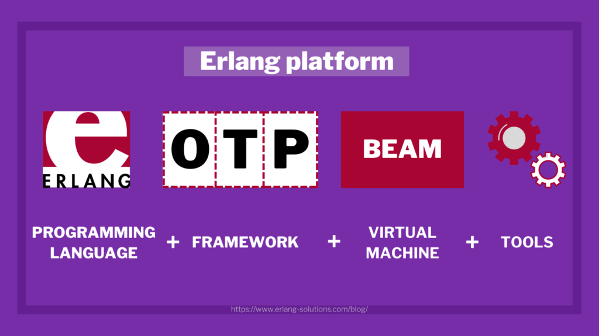
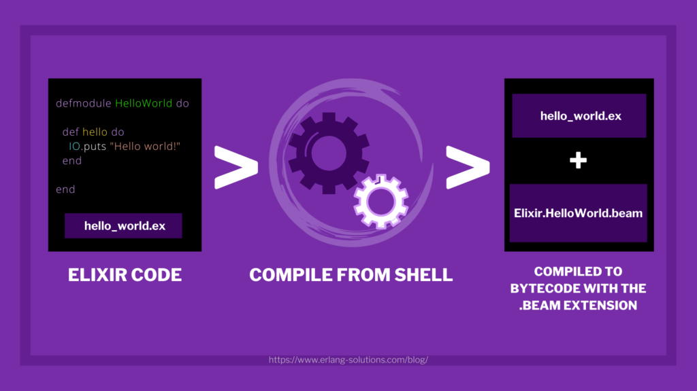

## Erlang Virtual Machine - The BEAM

- It simultaneously supports millions of users and transactions.
- It has a mechanism to detect failures and define strategies that allow a system to recover from them.
- It has all the necessary elements to develop a system capable of operating without interruptions.
- It allows system updates in real-time without stopping and in an "invinsible" way for end users.

### What is Erlang?

- The programming language with the same name, Erlang.
- The framework, OTP.
- A virtual machine, the BEAM (Bogdan / Björn’s Erlang Abstract Machine).
- A set of tools.

Erlang platform is best used to build distributed, scalable, concurrent and fault-tolerant systems. It is used to develop systems that:

- Require a large number of users and support easily adding more if necessary.
- Can easily detect and recover from errors.
- Always responds, even if there is an internal error. This means that the system cannot pause or wait indefinitely since that represents uncertainity for the users.
- Can be updated without stopping or interrupting user activities.
- Can be distributed.

### What is BEAM

It is the Erlang virtual machine, where Erlang or Elixir code is executed.
Elixir code is compiled into bytecode files that run on the virtual machine, and these files have the `.beam` extension.

Languages running on the BEAM have to comply with its characteristics. The BEAM:

- Manages concurrency and parallelism of a system.
- Errors have a minimal impact.
- Manages a recovery mechanism against those errors.
- It makes the most of the host computer's resources.

## Open Telecom Platform (OTP)

OTP is a set of Erlang libraries, which consists of the Erlang runtime system (ERTS), a number of ready-to-use components mainly written in Erlang, and a set of design principles for Erlang programs.

OTP provides modules and behaviours that represent standard implementations of common practices like process supervision, message passing, spawning tasks, etc.
