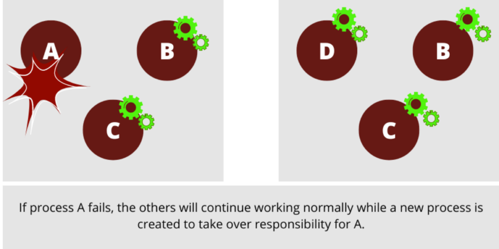

## Processes and Concurrency - [Read more](https://www.erlang-solutions.com/blog/understanding-elixir-processes-and-concurrency/)

### Processes

In Elixir, all code runs inside processes, and an application can have hundreds or thousands of them running concurrently.
Concurrency is achienved thanks to Erlang processes, which are created and managed by the BEAM

**How does it work?**

When the BEAM runs on a machine, it creates a `thread` on each available `processor` by default.In this `thread`, there is a `queue` dedicated to specific `tasks`, and each `queue` has a `scheduler` responsible for assigning a time and priority to the `tasks`.


As for the `tasks`, each one is executed in an isolated `process`.
This is simply the magic behind the scalability, distribution, and fault tolerance of a system built with Elixir or Erlang

### Fault-tolerance

The fault tolerance of a system refers to its ability to handle errors. The goal is that no failure, no matter how critical, disables or blocks the system and this is again achienved thanks to Erlang processes.
The processes are isolated elements that do not share memory and communicate through message passing.



### Example code

Leveraging concurrency in Elixir involves `spawning` processes, at least at the base level. Normally, you would not `spawn` processes, but either the BEAM does it for you behind the scenes, or you use process abstractions, like `GenServers`, `Tasks`, and others.

Here is an example that uses `spawn` to create processes that run code concurrently.

```elixir
defmodule Processes do


 # We are going to use regular expressions for the name format and the
 # email
 @valid_email ~r/^([a-zA-Z0-9_\-\.\+]+)@([a-zA-Z0-9_\-\.]+)\.([a-zA-Z]{2,5})$/
 @valid_name ~r/\b([A-ZÀ-ÿ][-,a-z. ']+[ ]*)+/


# There is a list of users with a name and email.
# The function validate_users_X calls another function:
# validate_user, which checks the format of the email and prints an
# ok or error message for each record


 # This function works SEQUENTIALLY
 def validate_users_sequentially() do
   IO.puts("Validating users sequentially...")


   users = create_users()


   Enum.each(users, fn elem ->
     validate_user(elem) end)
end


 # This function works CONCURRENTLY, with spawn
 def validate_users_concurrently() do
   IO.puts("Validating users concurrently...")


   users = create_users()


   Enum.each(users, fn elem ->
     spawn(fn -> validate_user(elem) end)
   end)
 end


 def validate_user(user) do
   user
   |> validate_email()
   |> validate_name()
   |> print_status()


 # This pauses for 2 seconds to simulate the process inserting
 # the records into the database
   Process.sleep(2000)
 end


 # This function receives a user, validates the format of the email and
 # add the valid_email key to the result.
def validate_email(user) do
   if Regex.match?(@valid_email, user.email) do
     Map.put(user, :valid_email, true)
   else
     Map.put(user, :valid_email, false)
   end
 end


# This function receives a user, validates the format of the name and
 # add the valid_name key to the result.
 def validate_name(user) do
   if Regex.match?(@valid_name, user.name) do
     Map.put(user, :valid_name, true)
   else
     Map.put(user, :valid_name, false)
   end
 end


 # This function receives a user that has already gone through
 # validation email and name and depending on its result, prints
 # the message corresponding to the status.
 def print_status(%{
       id: id,
       name: name,
       email: email,
       valid_email: valid_email,
       valid_name: valid_name
     }) do
   cond do
     valid_email && valid_name ->
       IO.puts("User #{id} | #{name} | #{email} ... is valid")


     valid_email && !valid_name ->
       IO.puts("User #{id} | #{name} | #{email} ... has an invalid name")


     !valid_email && valid_name ->
       IO.puts("User #{id} | #{name} | #{email} ... has an invalid email")


     !valid_email && !valid_name ->
       IO.puts("User #{id} | #{name} | #{email} ... is invalid")
   end
 end


 defp create_users do
   [
     %{id: 1, name: "Melanie C.", email: "melaniec@test.com"},
     %{id: 2, name: "Victoria Beckham", email: "victoriab@testcom"},
     %{id: 3, name: "Geri Halliwell", email: "gerih@test.com"},
     %{id: 4, name: "123456788", email: "melb@test.com"},
     %{id: 5, name: "Emma Bunton", email: "emmab@test.com"},
     %{id: 6, name: "Nick Carter", email: "nickc@test.com"},
     %{id: 7, name: "Howie Dorough", email: "howie.dorough"},
     %{id: 8, name: "", email: "ajmclean@test.com"},
     %{id: 9, name: "341AN L1ttr377", email: "Brian-Littrell"},
     %{id: 10, name: "Kevin Richardson", email: "kevinr@test.com"}
   ]
 end
end
```
